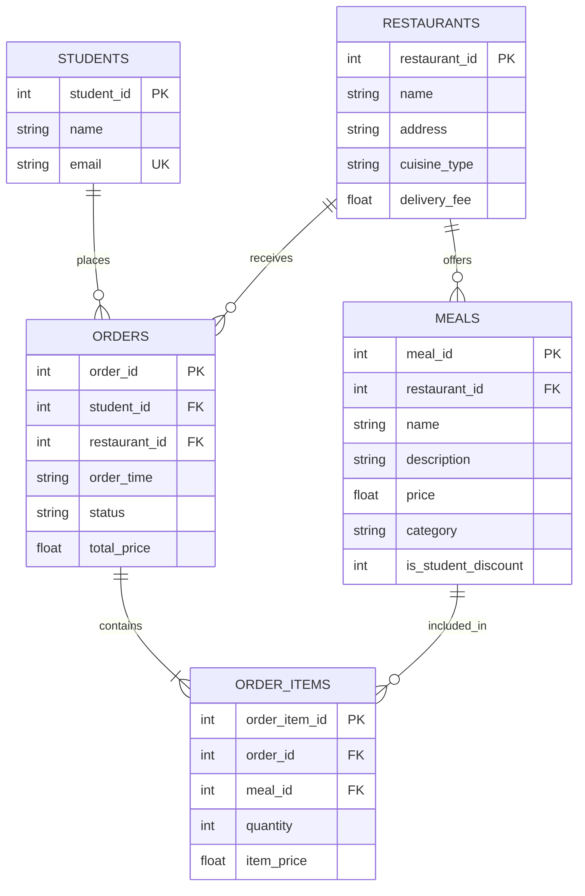

# E/R Diagram

This is our database model for **Affordable Eats**. It matches the tables created in `schema.sql`.

## Relationships

- One restaurant can offer many meals.
- One student can place many orders.
- One restaurant can receive many orders.
- One order contains one or more order items.
- Each order item refers to one meal.

## Tables and SQL files

- The tables are defined in `schema.sql`.
- The sample data is inserted from `seed.sql`.
- The database is initialized by running `python init_db.py`.
