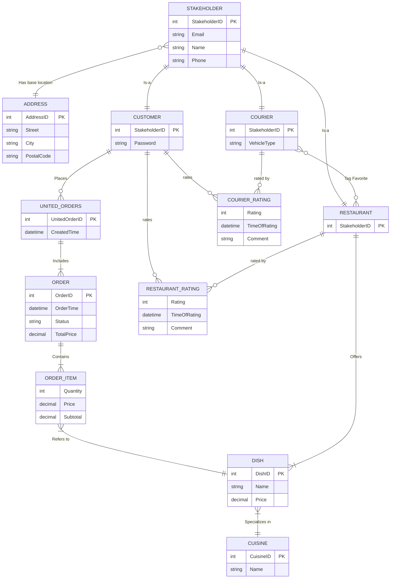

# E/R Diagram Placeholder

Add the final E/R diagram here when the database design is complete.

Current planned entities:

- `students`
- `restaurants`
- `meals`
- `orders`
- `order_items`

Current planned relationships:

- One restaurant has many meals.
- One student can place many orders.
- One order belongs to one restaurant.
- One order contains one or more order items.
- Each order item refers to one meal.

